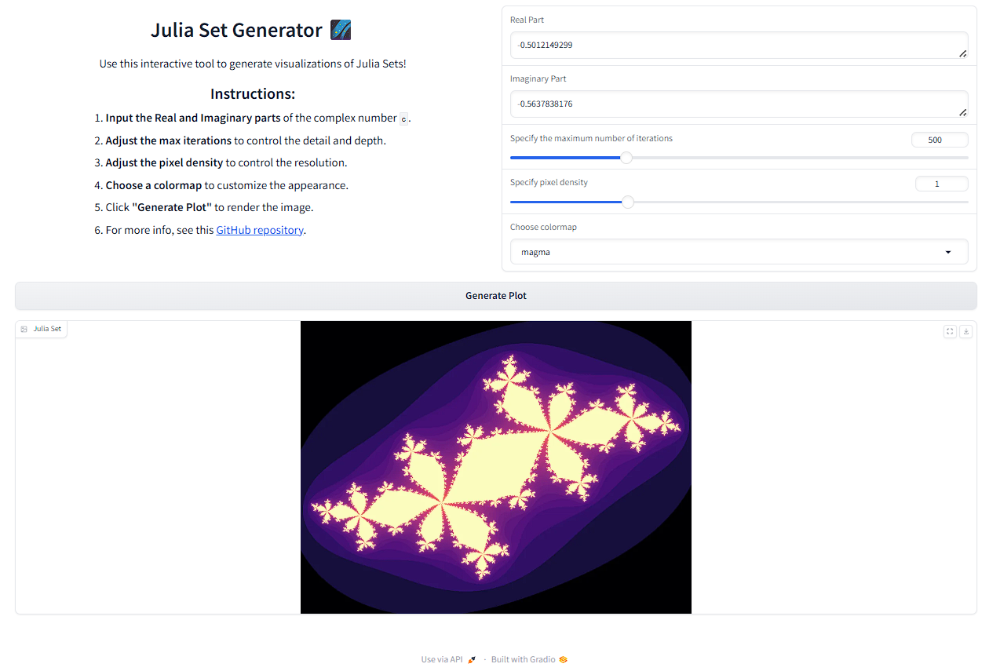

# Julia Set Visualizer using Gradio
This is a simple Gradio implementation of my Julia Set visualizer previously implemented and deployed in Streamlit.

Accessing the App
=================

To access this app, you can either

1. Clone the repository. Then, run 

`pip install -r requirements.txt`

on the terminal. It is ideal to create a virtual environment first before proceeding to the installation of the required libraries. Once done, you can then run

`python app.py`

on the terminal and use the app on your local server.

OR

2. Access the app via HuggingFace Spaces through this link (to add).